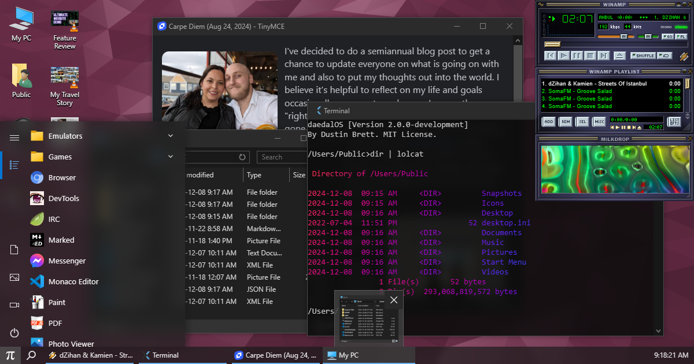

## 🌌 **AareevSrin OS** 🌌

# System 🧠

### [File System](https://github.com/jvilk/BrowserFS)

- File Explorer
  - Back, Forward, Recent locations, Up one level, Address bar, Search
  - Thumbnail & Details Views
- [Drag & Drop](https://developer.mozilla.org/en-US/docs/Web/API/HTML_Drag_and_Drop_API) File Support (internal & external)
  - Loading progress dialog
- ZIP ([write support](https://www.npmjs.com/package/fflate)), [ZIP](https://github.com/jvilk/BrowserFS/blob/master/src/backends/ZipFS.ts)/[ISO](https://github.com/jvilk/BrowserFS/blob/master/src/backends/IsoFS.ts) read support, [7Z/GZ/RAR/TAR/etc. extract](https://github.com/use-strict/7z-wasm) support
- Writes to [IndexedDb](https://developer.mozilla.org/en-US/docs/Web/API/IndexedDB_API)
- Group selection/manipulation & drag to sort/arrange
- Dynamic and auto cached icons for [music](https://github.com/Borewit/music-metadata-browser), images, video & emulator states
- Context Menus
  - Cut, Copy, Create shortcut, Delete, Rename
  - [Add file(s)](https://developer.mozilla.org/en-US/docs/Web/API/File/Using_files_from_web_applications), [Map directory](https://developer.mozilla.org/en-US/docs/Web/API/File_System_Access_API)
  - Open with options/dialog, Open file/folder location, Open in new window, Open Terminal here
  - Download, Add to archive, Extract here, Set as wallpaper, Convert audio/video/photo/spreadsheets, Properties (w/Details)
  - Sort by, New Folder, New Text Document
  - Screen Capture
- Keyboard Shortcuts
  - CTRL+C, CTRL+V, CTRL+X, CTRL+A, Delete
  - F2, F5, Backspace, Arrows, Enter
  - SHIFT+CTRL+R, SHIFT+F10, SHIFT+F12
  - In Fullscreen: Windows Key, Windows Key + R
- File information tooltips
- Allow sorting by name, size, type or date
  - Persists icon position/sort order

<p align="center">
  
</p>

<p align="center">
  <strong>A Windows-style portfolio experience built as an interactive operating system in the browser.</strong>
</p>

<p align="center">
  <a href="https://aareevsrinivasan.com">Live Site</a>
  ·
  <a href="https://github.com/Aareevs/My-Portfolio">Repository</a>
</p>

---

## What This Is

`AareevSrin OS` is my portfolio reimagined as a desktop environment.

Instead of a standard landing page, this project opens like a personal operating system with a boot flow, login screen, draggable windows, taskbar, start menu, desktop shortcuts, wallpapers, apps, media tools, and interactive projects.

It is both a portfolio and a product-like frontend experiment.

---

## Experience Highlights

- Windows-inspired desktop UI with boot, login, desktop, taskbar, start menu, and window management
- Interactive portfolio sections as native-feeling desktop apps
- Real file-system style browsing powered in the browser
- Drag, resize, minimize, maximize, and layered app windows
- Search, recent files, custom desktop icon placement, and session persistence
- Dynamic wallpapers, slideshow support, and media-friendly desktop behavior
- Built-in apps for projects, resume, browser, terminal, paint, photos, PDF viewing, Spotify, and more
- Emulator and retro-computing inspired experiences baked into the interface

---

## Built With

### Core Stack

- `Next.js`
- `React`
- `TypeScript`
- `styled-components`

### System + UI

- `BrowserFS`
- `motion`
- `react-rnd`
- `idb`
- `xterm`
- `Monaco Editor`

### Media + Desktop Tools

- `ffmpeg.wasm`
- `mediainfo.js`
- `music-metadata-browser`
- `jspaint`
- `pdf.js`
- `Webamp`
- `TinyMCE`

### Testing + Tooling

- `Jest`
- `Playwright`
- `ESLint`
- `Stylelint`
- `Prettier`
- `Husky`

---

## App Surface

This portfolio includes a large in-browser app surface, including:

- `About Me`
- `My Projects`
- `Resume`
- `Contact Me`
- `Browser`
- `Terminal`
- `Photos`
- `Paint`
- `PDF`
- `Spotify`
- `Messenger`
- `Monaco Editor`
- `TinyMCE`
- `Webamp`
- `Emulator / retro app experiences`

---

## Local Development

### Requirements

- `Node.js`
- `npm` or `yarn`

### Install

```bash
npm install --legacy-peer-deps
```

### Run locally

```bash
npm run build:prebuild
npm run dev -- -p 3001
```

Open `http://localhost:3001`.

### Production export

```bash
npm run build
```

The static site is generated in `out/`.

---

## Deployment Notes

- The site is deployed via `GitHub Pages`
- Large media files and ROM-sized assets should live outside the repo if they exceed GitHub's file limits
- Small desktop assets, wallpapers, icons, and source code remain in the repository

---

## Project Structure

```text
components/   App windows, taskbar, desktop, login, and system UI
contexts/     Session, filesystem, process, menu, and viewport state
pages/        Next.js entry points
public/       Icons, wallpapers, app assets, desktop files, and static resources
scripts/      Search indexing, file tree generation, icon preload, and build helpers
styles/       Global styling, theme tokens, shared UI styles
utils/        Media, search, ffmpeg, imagemagick, and helper utilities
e2e/          Playwright coverage for desktop and app behavior
```

---

## Why This Project Exists

I wanted my portfolio to feel memorable, tactile, and personal.

A normal portfolio shows projects.

This one lets you explore them through a full desktop interface with its own atmosphere, navigation model, and personality.

---

## Credits

This project also builds on open-source tools, libraries, and browser experiments that made the desktop-style experience possible. A condensed credits list is available in [`public/CREDITS.md`](./public/CREDITS.md).

---

## Author

**Aareev Srinivasan**

- Website: [aareevsrinivasan.com](https://aareevsrinivasan.com)
- GitHub: [@Aareevs](https://github.com/Aareevs)
- Email: `aareevs@gmail.com`
